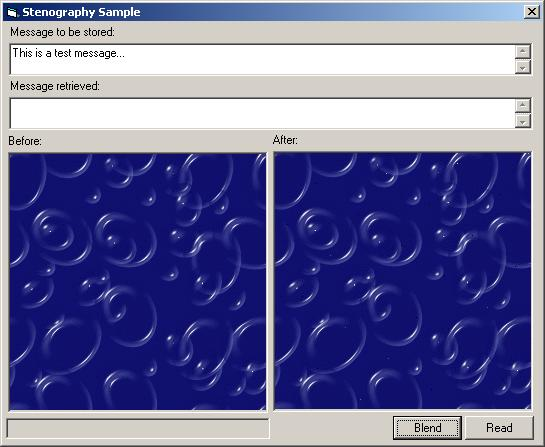



## Stenography Example

### Description

This is a small sample of blending text messages into a graphic file such as a bitmap. I haven't tested on images other than bitmaps. It doesn't just tack the data at the end of the file, but actually blends it through out. Any encryption algorithm can also be used with this to make it more secure. A key file is generated during the process and is required to read the message.
 
### More Info
 

             |
---                |---
**Submitted On**   |2003-04-03 16:46:58
**By**             |[Donathan Hutchings](https://github.com/Planet-Source-Code/PSCIndex/blob/master/ByAuthor/donathan-hutchings.md)
**Level**          |Beginner
**User Rating**    |5.0 (35 globes from 7 users)
**Compatibility**  |VB 5\.0, VB 6\.0
**Category**       |[Encryption](https://github.com/Planet-Source-Code/PSCIndex/blob/master/ByCategory/encryption__1-48.md)
**World**          |[Visual Basic](https://github.com/Planet-Source-Code/PSCIndex/blob/master/ByWorld/visual-basic.md)
**Archive File**   |[Stenograph156857432003\.zip](https://github.com/Planet-Source-Code/donathan-hutchings-stenography-example__1-44470/archive/master.zip)

